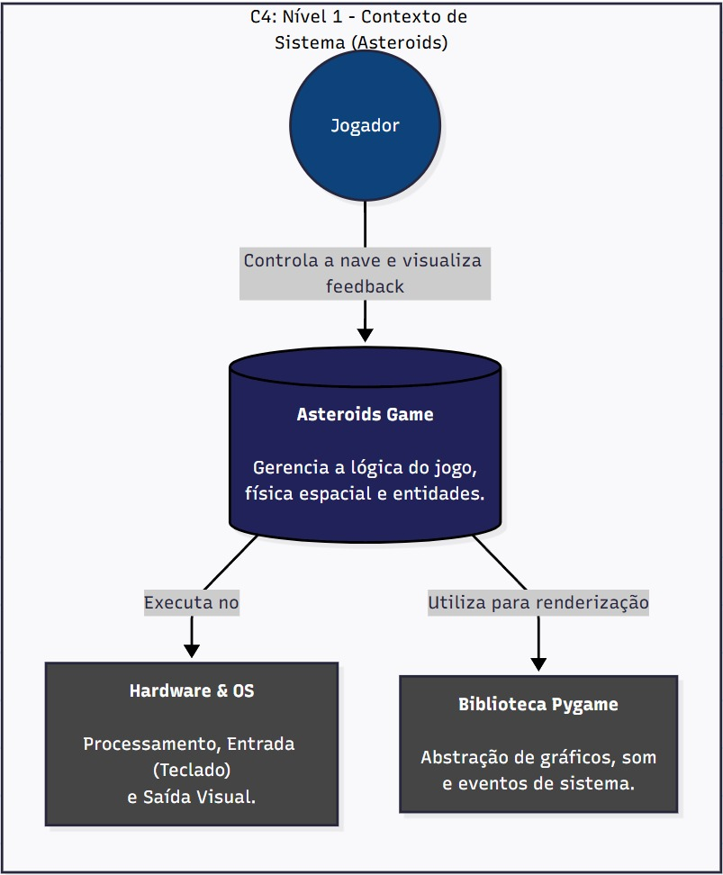
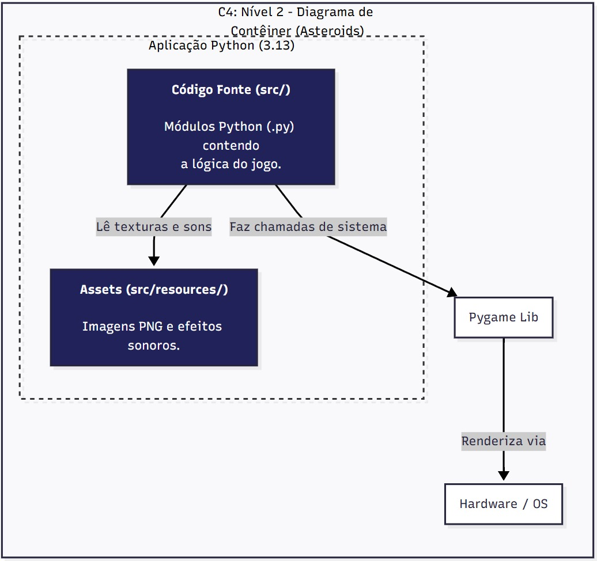
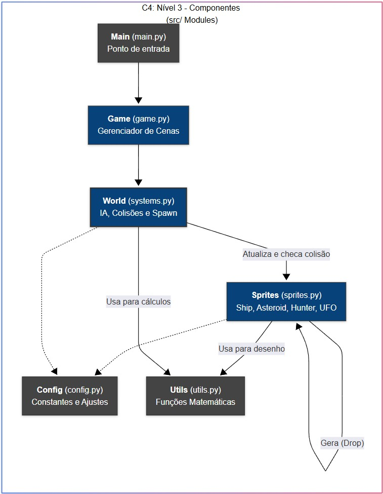

# Asteroids
Este projeto é um fork de https://github.com/jucimarjr/asteroids_pygame.
Usando Python (3.13):

```bash
pip install -r requirements.txt
```

### Este projeto usa pre-commit
Para mais informações sobre o que ele faz, confira [este link](https://pre-commit.com/).
Mas basicamente, ele limpa o código antes de commitar (enviar) os arquivos. <br/>
Como usar:
1. Após instalar os requisitos, execute `pre-commit install` pelo menos uma vez.
2. Ele rodará automaticamente antes de qualquer `git commit`, mas pode ser acionado manualmente usando o comando `pre-commit`.
3. Se o pre-commit modificar algum arquivo, você deve adicioná-los à área de staging usando `git add`.

Nota: o pre-commit apenas modifica arquivos que estão na área de staging.

## Como Executar
Execute `python src/main.py`
Existe um modo de depuração (debug) para testar coisas, principalmente a parte visual/desenho. Execute o arquivo com a flag `--debug`:
`python src/main.py --debug`

## Novas Funcionalidades
* Powerup de Escopeta (Shotgun)
* Powerup de Vida Extra (One Up)
* Asteroide Resistente (Tough Asteroid)
* Asteroide Explosivo (Explosive Asteroid)
* Inimigo que Persegue o Jogador (Player Targeting Enemy)

## Diagramas






## Créditos
Assets originais dos powerups por Eric "ConcernedApe" Barone  
Textura ausente (Missing texture) pela Valve Corporation